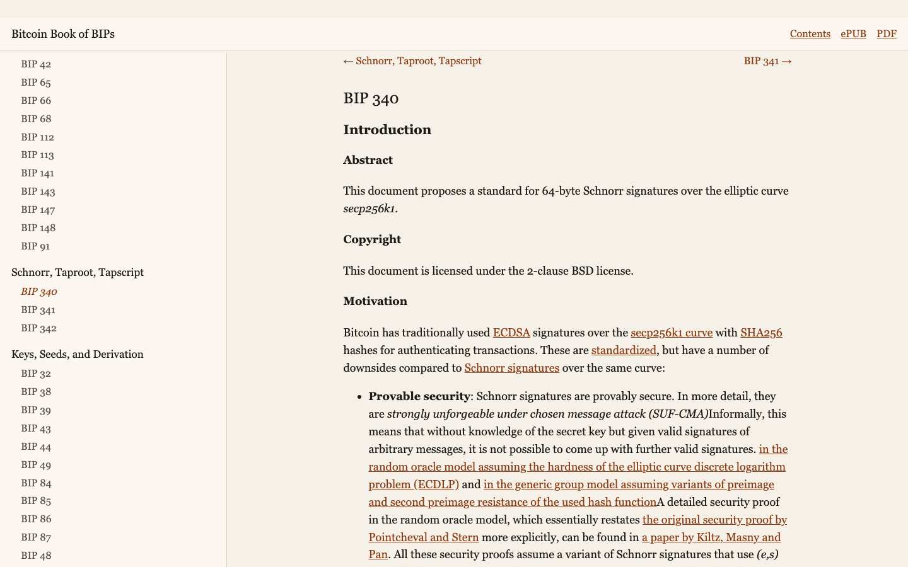

# bitcoin-bips-book

The [Bitcoin Improvement Proposals](https://github.com/bitcoin/bips), compiled into a readable book.

This collection focuses on deployed and complete proposals — the ones that shape Bitcoin today — grouped by theme rather than by number. Closed and withdrawn BIPs are omitted so the book stays readable. The BIP text itself is unchanged.

The book is compiled by Adam Shannon. The BIPs are written by their original authors. Cover image by [@stl1988](https://github.com/stl1988), generated with Seedream v4.



## Get the book

- Read online: [adamdecaf.github.io/bitcoin-bips-book](https://adamdecaf.github.io/bitcoin-bips-book/) ([contents](https://adamdecaf.github.io/bitcoin-bips-book/book/))
- [ePUB](https://github.com/adamdecaf/bitcoin-bips-book/raw/master/bitcoin-bips-book.epub)
- [PDF](https://github.com/adamdecaf/bitcoin-bips-book/raw/master/bitcoin-bips-book.pdf)

## What's inside

Chapters, not BIP numbers:

1. Process and history — how BIPs work, version bits, buried deployments
2. Addresses and encodings — P2SH, Bech32, Bech32m, bitcoin: URIs
3. Consensus changes that shipped — P2SH, CLTV, CSV, SegWit
4. Schnorr, Taproot, Tapscript
5. Keys, seeds, and derivation — BIP32, mnemonics, account paths
6. Output script descriptors
7. Partially signed transactions (PSBT)
8. The peer-to-peer network
9. Mining and block templates
10. Paying people — payment protocol, payjoin, silent payments
11. Scripts, policy, and RBF

## Other books

Same idea, different specs. The spec text in each book is unchanged from upstream.

- [Nostr Book of NIPs](https://github.com/adamdecaf/nostr-book) ([read](https://nostr-book.org/))
- [Lightning Book of BOLTs](https://github.com/adamdecaf/lightning-bolt-book) ([read](https://adamdecaf.github.io/lightning-bolt-book/))
- [Cashu Book of NUTs](https://github.com/adamdecaf/cashu-nuts-book) ([read](https://adamdecaf.github.io/cashu-nuts-book/))

## Contributing

Display, grouping, and wrapping-prose improvements are welcome.

Do **not** edit files under `bips/`. That tree is a clone of [bitcoin/bips](https://github.com/bitcoin/bips). If a BIP is wrong, unclear, or out of date, send the change upstream.

Editorial wrapping lives in `include/`. Reading order lives in `scripts/create.sh`.

## Development

You need [pandoc](https://github.com/jgm/pandoc/blob/main/INSTALL.md). PDF uses [WeasyPrint](https://weasyprint.org/) when it is installed (`xelatex` is a fallback). On macOS:

```
brew install pandoc weasyprint
```

Clone this repo, then pull the BIPs and build:

```
make setup    # clones bitcoin/bips into ./bips and converts mediawiki to markdown
make epub
make pdf
make html     # writes the web book into docs/book/
```

`make setup` also writes the upstream git commit into `include/git.md` so the book records which snapshot it was built from.

## License

The code that generates this book is public domain (see [LICENSE](LICENSE)). BIP content follows the license of each document in [bitcoin/bips](https://github.com/bitcoin/bips).
